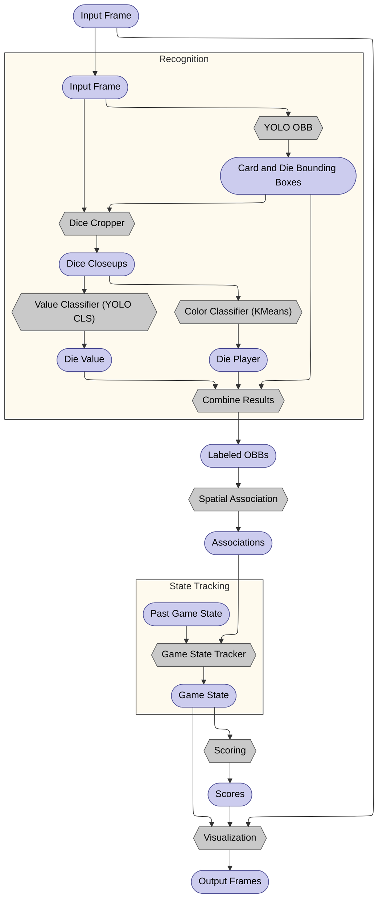

# SpotOn

## Notes for user

#### Venv
```bash
uv venv # or use `python -m venv` and pip if you like ig
source .venv/bin/activate
uv pip install -r requirements.txt # TODO: simplify requirements.txt
```

#### OpenCV dependencies
`sudo apt install libglib2.0-0 libsm6 libxrender1 libxext6` may be required to install dependencies for opencv gui stuff

#### Data
Copy the contents of [this google drive folder](https://drive.google.com/drive/folders/1VSm9NnftphKB87fiTHYBRZ7yb-MMln61?usp=sharing) into `/video_data`, then run `python data_prep/video_data_rename.py` to rename/rearrange these videos to the format expected by the project.

### Running
`python pipeline.py` to run on example video.
To try another video, just modify the script to take new input.


## Advanced notes
### Training
- `data_prep/yolo_preprocess.py` must be run before training YOLO model

### Tips for connecting camera
Camdroid and OBS seem to work well

## Methods

- Recognition (`classify_dice.py`)
Bounding boxes (with classes `die`, `ace`, `two`, `three`, `four`) are via YOLOv8-obb. Dice are then further classified by the player classifier (color-based via $k$-means) and the value classifier (YOLOv8-cls). The recognition pipeline outputs classified bounding boxes (classes: `ace`, `two`, `three`, `four`, `red_1`, `red_2`, ..., `blue_5`, `blue_6`, and `INVALID_DIE`).

- State tracking and scoring (`spatial_association.py`, `tracking.py`, `scoring.py`)
Dice are associated with cards based on if their bounding box centroids fall within the card's bounding box. This information is passed to the dice tracker, which stores information about the game state over time. We experimented with more complex methods and enhancements to this procedure (e.g. IoU-based associatiation, Kalman filter in tracker to mitigate frame-to-frame flicker), but we found simple methods to produce the best results.


Pipeline visualization


